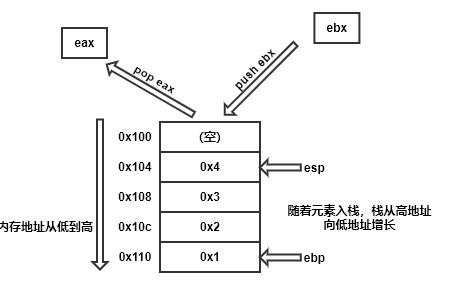
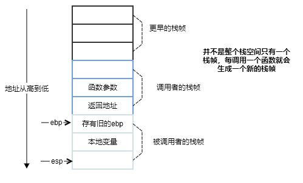
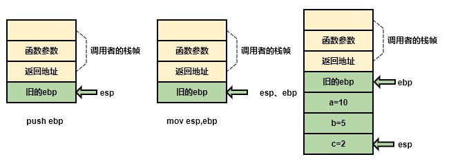
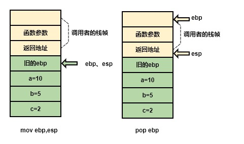

# C函数调用与栈帧分析

> 文章引用自[Cyberangel](https://www.yuque.com/cyberangel/rg9gdm/gcz7x2)，有一些修改，使用intel语法

---

**栈介绍**

> 栈（Stack）是一种后进先出的数据结构，两种基本操作：push将元素压入栈，pop将元素出栈。栈指针esp指向栈顶元素，ebp指向栈底元素。

下图中栈中数据的入栈顺序为`0x1 0x2 0x3 0x4`，如果一次性出栈顺序为`0x4 0x3 0x2 0x1`

栈后进先出的特性符合我们调用函数的方式：父函数调用子函数，然后子函数先返回，父函数再返回。

另外：由于数据被指针指向才能被访问的特点，出栈操作后，指针不再指向数据，从而使数据无法被访问被清除，栈中的数据其实还在。



---

**栈帧介绍**

> 栈帧（Stack frame）是专门保存函数调用中各种信息（参数、返回地址、本地变量等）的栈，一般把esp和ebp中间的区域当作栈帧。



函数调用中，调用者（caller）和被调用者（callee）有以下关系：

- 调用者需要知道在哪里获取被调用者返回的值
- 被调用者需要知道传入的参数在哪里
- 返回地址在哪里

同时，被调用者返回后，要恢复调用者的栈帧，就需要恢复寄存器ebp和esp的值和调用前一致，因此这些也要用栈保存。

---

**函数的调用**

示例程序源码：

```c
int MyFunction(int x, int y, int z)
{
    int a, b, c;
    a = 10;
    b = 5;
    c = 2;
    ...
    return;
}

int TestFunction()
{
    MyFunction1(1, 2, 3);
    ...
}
```


编译后的汇编代码：

```bash
_MyFunction:
    push ebp            ; //保存ebp的值
    mov  ebp, esp       ; //将esp的值赋给ebp，使新的ebp指向栈顶
    sub  esp, 0x12  		; //分配额外空间给本地变量
   	mov  qword ptr [ebp-4], 10  ;  //对栈中的内存进行赋值操作
    mov  qword ptr [ebp-8], 5  ;   //对栈中的内存进行赋值操作
    mov  qword ptr [ebp-12], 2  ;  //对栈中的内存进行赋值操作
```



此时调用者做的事情：

- 将被调用者的参数压入栈（调用者的栈帧）
- 将返回地址压入栈（调用者的栈帧）

被调用者做的事情：

- 将调用者的ebp压入栈（被调用者的栈帧），此时被esp指向
- 将esp值赋给ebp，产生新的栈帧

接下来用`sub esp 0x12`开拓0x12单位的空间，然后再用`mov  qword ptr`给变量a,b,c赋值

---

**函数的返回**

函数完成任务后从esp移动到ebp处，弹出旧的ebp，恢复到函数调用前的状态

最后有一个ret指令，相当于pop+jump，首先将返回地址弹出栈保存在eip中，然后无条件跳到返回地址获取新的指令

```c
int MyFunction( int x, int y, int z )
{
    int a, int b, int c;
    ...
    return;
}
```

编译后汇编代码如下：

```bash
_MyFunction:
    push ebp
    mov  ebp, esp
    ...
    mov esp, ebp
    pop ebp
    ret
```


