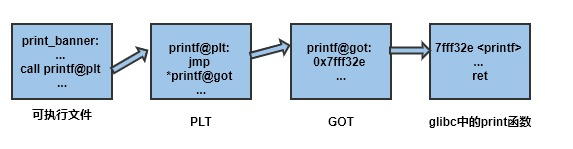

# PLT和GOT

> 文章引用自：[Cyberangel-Pwn入门](https://www.yuque.com/cyberangel/rg9gdm/uvfhz5)

---

**引入示例**

```c
#include <stdio.h>
void print_banner(){
    printf("Welcome to World of PLT and GOT\n");
}
int main(void){
    print_banner();
    return 0;
}
```


> 后面需要对中间文件test.o及可执行文件test反编译，分析汇编指令，因此编译链接使用i386架构，而非现代Linux的x86_64架构

编译：`gcc -Wall -g -o test.o -c test.c -m32`

链接：`gcc -o test test.o -m32`


print_banner函数的汇编指令：

```shell
080483cc <print_banner>:
 80483cc:    push %ebp
 80483cd:    mov  %esp, %ebp
 80483cf:    sub  $0x8, %esp
 80483d2:    sub  $0xc, %esp
 80483d5:    push $0x80484a8  
 80483da:    call **<printf函数的地址>**
 80483df:    add $0x10, %esp
 80483e2:    nop
 80483e3:    leave
 80483e4:    ret
```


---

**程序分析**

print_banner函数调用了位于glibc动态库内的print函数，编译和链接阶段无法知道print函数的加载地址，只有进程运行后才能确定

进程运行起来后，print函数确定，那么call指令接下来要修改（重定位），一个简单的方法就是将指令中的`**<printf函数的地址>**`修改为函数真正的地址（运行时重定位），但存在几个问题：

- 现代操作系统只能修改数据段，不允许修改代码段
- 如果print_banner函数在一个动态库（.so）内，修改了代码段，无法做到系统内所有进程共享同一个动态库


`objdump -d main.o`查看print_banner函数的汇编：

```shell
00000000 <print_banner>:
      0:  55                   push %ebp
      1:  89 e5                mov %esp, %ebp
      3:  83 ec 08             sub   $0x8, %esp
      6:  c7 04 24 00 00 00 00 movl  $0x0, (%esp)
      d:  e8 fc ff ff ff       call  e <print_banner+0xe>
     12:  c9                   leave
     13:  c3                   ret
```


其中call指令的操作数是`fc ff ff ff`（x86架构是小端的字节序），翻译成符号为-4。由于编译阶段不知道print函数的地址，所以放一个-4，然后用重定位项来描述：这个地址在链接时要修正，根据print函数地址，这个过程称为**链接时重定位**

链接时操作：

- 各个中间文之间的同名section合并
- 对代码段、数据段及符号进行地址分配
- 链接时重定位修正

但是只有重定位过程能修改中间文件中函数内指令，也只能修改指令中的操作数，无法修改汇编指令。他也无法知道print函数在glibc运行库中，或是在其他.o中，只能生成print函数的汇编指令，使无论哪种情况都可以运行。如果是在.o中，则地址确定，可以直接重定位，如果在glibc中，则无法确定地址。**链接器会生成一段额外的小代码，通过这段代码获取printf函数地址**。


额外代码：

```shell
.text
...
// 调用printf的call指令
call printf_stub
...
printf_stub:
    mov rax, [printf函数的储存地址] // 获取printf重定位之后的地址
    jmp rax // 跳过去执行printf函数
.data
...
printf函数的储存地址：
　　这里储存printf函数重定位后的地址
```


**printf定义在动态库中，链接器生成一小段代码print_stub，然后print_stub地址取代printf函数地址，原来的需求转化为堆print_stub做链接重定位，运行时才对printf做运行时重定位。**

---

**PLT和GOT**

前文简单的例子说明了两点：

> 需要存放外部函数的数据段；获取数据段存放函数地址的一小段额外代码

如果可执行文件中调用多个动态库函数，每个函数都需要这两个东西，每个形成一个表，每个函数使用其中的一项。存放函数地址的数据表称为重局偏移表GOT（global offset table），额外代码表称为程序链接表PLT（procedure link table）。



> 上一篇：[C语言调用与栈帧的分析](/docs/c.md)		下一篇：无
