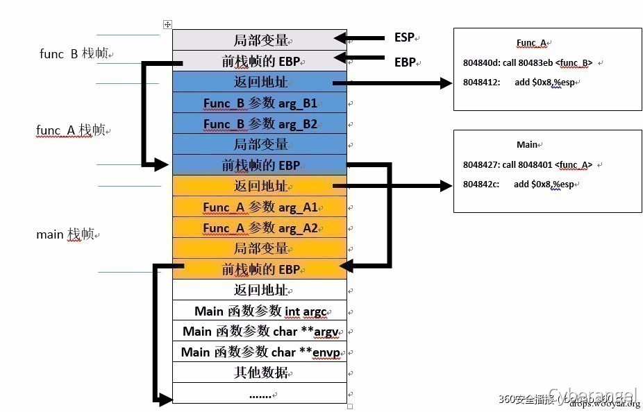
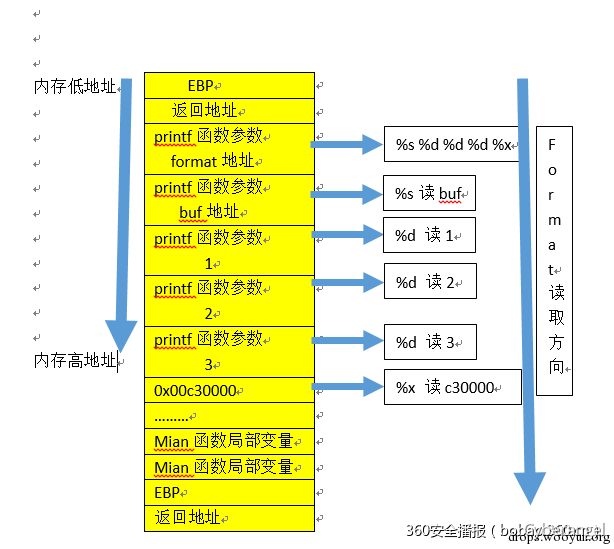

# 格式化字符串



函数print()、fprint()、等print()函数都可以按照一定的格式将数据进行输出

```c
printf("My Name is:  %s" , "bingtangguan")
```


print()函数一般形式为`print('format',输出表列)`，其中format：`%[标志][输出最小宽度][.精度][长度]`，其中输出最小宽度，用十进制整数来表示输出的最少位数，若实际位数大于定义宽度，按实际输出；否则用0或空格补齐位数，而类型：

```shell
%c：输出字符，配上%n可用于向指定地址写数据。
 
%d：输出十进制整数，配上%n可用于向指定地址写数据。
 
%x：输出16进制数据，如%i$x表示要泄漏偏移i处4字节长的16进制数据，%i$lx表示要泄漏偏移i处8字节长的16进制数据，32bit和64bit环境下一样。
 
%p：输出16进制数据，与%x基本一样，只是附加了前缀0x，在32bit下输出4字节，在64bit下输出8字节，可通过输出字节的长度来判断目标环境是32bit还是64bit。
 
%s：输出的内容是字符串，即将偏移处指针指向的字符串输出，如%i$s表示输出偏移i处地址所指向的字符串，在32bit和64bit环境下一样，可用于读取GOT表等信息。
 
%n：将%n之前printf已经打印的字符个数赋值给偏移处指针所指向的地址位置，如%100×10$n表示将0x64写入偏移10处保存的指针所指向的地址（4字节），而%$hn表示写入的地址空间为2字节，%$hhn表示写入的地址空间为1字节，%$lln表示写入的地址空间为8字节，在32bit和64bit环境下一样。有时，直接写4字节会导致程序崩溃或等候时间过长，可以通过%$hn或%$hhn来适时调整。
 
%n是通过格式化字符串漏洞改变程序流程的关键方式，而其他格式化字符串参数可用于读取信息或配合%n写数据。
```


## 1、print()函数的参数个数不固定

先看一个普通程序：

```c
#include <stdio.h>
int main(void){
    int a=1,b=2,c=3;
    char buf[]="test";
    printf("%s %d %d %d %x\n",buf,a,b,c),
    return 0;
}
```


编译

```bash
bingtangguan@ubuntu:~/Desktop/format$ gcc -fno-stack-protector -o format format.c
bingtangguan@ubuntu:~/Desktop/format$ ./format 
test 1 2 3 c30000
```





相同，如果我们能控制format，就可以一直读取内存数据

```c
printf("%s %d %d %d %x %x %x %x %x %x %x %xn",buf,a,b,c)
bingtangguan@ubuntu:~/Desktop/format$ ./format2
test 1 2 3 c30000 1 80482bd bf8bf301 2f 804a000 740484d2 747365
```


当然并不能满足我们随机读取的要求，用下面这个例子

```c
#include <stdio.h>
int main(int argc, char *argv[])
{
    char str[200];
    fgets(str,200,stdin);
    printf(str);
    return 0;
}
```


我们直接尝试读取str[]的内容，gdb调试单步运行完`call 0x8048340 <fgets@plt`>，之后输入`AAAA%08x%08x%08x%08x%08x%08x`，然后我们执行到printf()函数，此时的栈区，特别注意下0x41414141（这是我们str的开始）

```c
>>> x/10x $sp
0xbfffef70: 0xbfffef88  0x000000c8  0xb7fc1c20  0xb7e25438
0xbfffef80: 0x08048210  0x00000001  0x41414141  0x78383025
0xbfffef90: 0x78383025  0x78383025
```


继续执行，成功读取到AAAA

```c
AAAA000000c8b7fc1c20b7e25438080482100000000141414141
```

## 2、可以利用%n格式符写入数据

%n作用是把前面已经打印的长度写入某个内存地址


```c
#include <stdio.h>
int main(){
  int num=66666666;
  printf("Before: num = %d\n", num);
  printf("%d%n\n", num, &num);
  printf("After: num = %d\n", num);
}

//gcc -m32 -fno-stack-protector -o main main.c

$ ./main
Before: num = 66666666
66666666
After: num = 8
```

通过上面的例子发现我们已经成功通过%n修改了num的值


## 3、自定义打印字符串宽度

我们在格式符中间加上一个十进制整数来表示输出的最少位数，若实际位数多余定义的宽度则按照实际宽度输出；若实际位数少于定义的宽度则用空格或0补齐，比如我们想把地址0x8048000写入内存，要做的就是把该地址对应的10进制134512640作为格式控制符控制宽度即可。

把上一段代码修改下：

```c
#include <stdio.h>
int main()
{
  int num=66666666;
  printf("Before: num = %d\n", num);
  printf("%.134512640d%n\n", num, &num);
  printf("After: num = %x\n", num);
}

//gcc -m32 -fno-stack-protector -o main main.c

$ ./main
Before: num = 66666666
中间的0省略...........
00000000000000000000000000000000000000000000000000000000000000000000000000000000000000000000000000000000000000000000000000000000000000000000000066666666
After: num = 8048000
```

